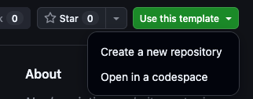

# Cloudflare Workers Discord Bot Template

A minimal, production-shaped starting point for a **Discord bot on a Cloudflare Worker**: HTTP interactions with mandatory signature verification, three worked slash commands, command registration that runs itself on every deploy, and separate non-production and production environments that each own their own Discord application.

This is a GitHub template repository. Create your own project from it, copy the example commands, then delete them and write your own. Nothing here deploys to Cloudflare or contacts Discord until you deliberately turn deployment on.

## What you get

- **An endpoint Discord will accept.** The script creates an endpoint, on a Cloudflare worker, with the basic interactions and required signature verification checks.

- **Three worked commands.** 
   - `/ping` returns a `PONG`, and it's required by Discord 
   - `/echo` reads a text string from the user and echoes it back 
   - `/slow` is an example of a slow or async interaction that edits a response once the slow process is complete.

- **One command registry, two readers.**  To keep the bot Discord commands *and* interactions on the worker in sync, we provide a single definition module that both Workers and Discord registration use.

- **Registration on deploy.** Automation is built-in to the repo so that a merge to `develop` registers commands to your test guild; a merge to `main` registers them globally. Both run *after* the Worker is ready, enabled by a flag (and also disabled if needed).

- **One Discord application per environment.** A non-production Worker never holds a production public key, application ID, or bot token. Combined with having automated deploys, this lets develop branch work progress and be tested without risk of production.

- **Tests that run offline in the real runtime**, using the `@cloudflare/vitest-pool-workers` library, tests for the worker code is checked using Miniflare, simulating the worker environment on a local dev system.  No Cloudflare account, no Discord application, and no network.  Code can be created and tested before enabling the deployment flag.

- **Contract tests** that fail if non-production and production configuration get crossed.

## Quickstart (via Template)

1. **Create your repository.** 

   Select *Use this template* on GitHub for a clean start.  This will create a **new** repo under your account on GitHub that contains the project assets.

   

2. **Clone it, install, and run setup.** 

   1. Clone the repository you *just* created, **not this template repo**.

      ```sh
      git clone https://github.com/YOUR-OWNER/YOUR-REPOSITORY.git
      cd YOUR-REPOSITORY
      ```

   2. Install required dependencies for Node and/or Workers

      ```sh
      npm install
      ```

   3. WAIT! When you run this, the setup script will prepare your new repo. Some files, including this one, will get swapped out.  So when this is done, go to [Using This Template](docs/using-this-template.md).

      ```sh
      npm run setup
      ```

## Everyday commands

| Command | What it does |
| --- | --- |
| `npm run dev` | Run the Worker locally with Wrangler |
| `npm test` | Run the unit tests with coverage thresholds, then the configuration contract tests |
| `npm run test:watch` | Re-run unit tests as you edit |
| `npm run lint` | Check JavaScript style |
| `npm run lint:fix` | Apply safe automatic style fixes, then review the diff |
| `npm run changeset` | Record the release impact of a change |
| `npm run deploy:non-prod` | Deploy the non-production Worker |
| `npm run deploy:production` | Deploy the production Worker |
| `npm run register:dry-run` | Print the command-registration plan without contacting Discord |
| `npm run register:non-prod` | Register the commands with the non-production Discord application, scoped to one guild |
| `npm run register:production` | Register the commands globally with the production Discord application |
| `npm run setup:github` | Apply and verify the GitHub environments, deployment variable, and branch ruleset |

The `register:*` scripts need `DISCORD_TOKEN`, `DISCORD_APPLICATION_ID`, and — for the guild-scoped one — `DISCORD_GUILD_ID`, each belonging to that environment's own Discord application. [The Discord bot](docs/discord-bot.md#registering-commands) covers where each value comes from, why registering is a separate act from deploying, and what the bulk-overwrite endpoint replaces.

Node.js 22 is the supported version. `.nvmrc` is the single source of truth — run `nvm use` if you manage Node with nvm — and `engines.node` plus every GitHub Actions workflow read from it.

Local development uses the top-level Wrangler configuration and never deploys a Worker. 

Keep production credentials out of local environment files. No secrets or credentials ever belong in the contents of the repo. These should only be stored in the GitHub secrets, used by actions.

## Deployment

This template offers two paths to deploy to Cloudflare:
- **Preferred** - use the GitHub actions that are included with this repo to automatically deploy on merges to `develop` or `main`.
- use the built-in `npm` scripts to deploy directly to Cloudflare from a dev or working system, skipping the GitHub action

**For the automated approach:**

Merges to `develop` deploy to the non-production Worker defined in `wrangler.jsonc`; merges to `main` deploy production after an environment approval gate. 

*Both* are skipped until the GitHub Actions repository **variable** `DEPLOY_ENABLED` is set to `true`. That flag is not a secret — it is only the explicit opt-in, which keeps this template and unconfigured projects from ever contacting Cloudflare. The Cloudflare API token and account ID *always* remain GitHub secrets.

**For the manual approach:**

You can also deploy from your machine with `npm run deploy:non-prod` or `npm run deploy:production`, but the reviewed GitHub Actions path is the intended route to production.

**WARNING!**

Do *not* connect a Worker to this repository through the Cloudflare dashboard's **Settings > Builds** ("Workers Builds" Git integration). 

That is a separate auto-deploy mechanism that bypasses this workflow's environment approvals and test gates. See [Do not also connect the repository in the Cloudflare dashboard](docs/using-this-template.md#do-not-also-connect-the-repository-in-the-cloudflare-dashboard).

## Documentation

| Document | Read it when |
| --- | --- |
| [Using this template](docs/using-this-template.md) | Starting a project: choosing template vs. clone, naming Workers, bindings, secrets, repository rules |
| [The Discord bot](docs/discord-bot.md) | Understanding the interaction lifecycle, the module layout, and how the bot is tested offline |
| [Gitflow and branching](docs/gitflow-and-branching.md) | Day-to-day branching, pull requests, promotion, and rollback |
| [Versioning and changesets](docs/versioning-and-changesets.md) | Cutting a version, understanding the release pull request and tags |
| [Using AI with this template](docs/using-ai.md) | Working with AI assistants: instruction files, MCP servers, and the guardrails |
| [CONTRIBUTING.md](CONTRIBUTING.md) | Improving this template itself |
| [CHANGELOG.md](CHANGELOG.md) | Checking what changed and whether you need to migrate |

## AI is already wired in

This template was built with AI assistance, and it ships ready for it. You do not have to use AI — every command works the same by hand — but if you do, the setup is done:

- **Instruction files** tell an assistant how to work here: [claude.md](claude.md) is the canonical maintenance guide, with matching entry points in [AGENTS.md](AGENTS.md) and [.github/copilot-instructions.md](.github/copilot-instructions.md). They carry a versioned contract, so changes in expectations are reviewable rather than silent.
- **MCP servers** for Cloudflare documentation, Discord documentation, and GitHub are declared in `.mcp.json` and `.vscode/mcp.json`, in both schema formats. An assistant can look up current Wrangler behavior or Discord's interaction contract instead of recalling a version that changed a year ago. Neither file contains a token. The two documentation servers need no authentication; the GitHub server prompts you to authorize it on first use and stays unavailable until you do.
- **Contract tests** in `test/contracts/` are one safety net. Suggest pointing non-production at a production database and you get a failing test immediately, not a subtle bug discovered later.
- **Unit tests** are a second safety net, with a coverage ratchet over `src/` and `scripts/lib/` behind them. Agents should NEVER delete tests or reduce test coverage with a proposed change, unless directed by a human to do so — and `npm test` now fails if they try.
- **Human gates** cover the rest: deployment stays off until you opt in, production requires approval, and Cloudflare credentials live in GitHub secrets that no local tool can read. Automation can open a pull request; it cannot ship to production.

Instructions guide an assistant; they cannot constrain one. That is why the promises that matter are tests and gates rather than prose. See [Using AI with this template](docs/using-ai.md) for the details, including how to switch to the application-facing instruction files once you start your own project.

## License

MIT. See [LICENSE.md](LICENSE.md).
